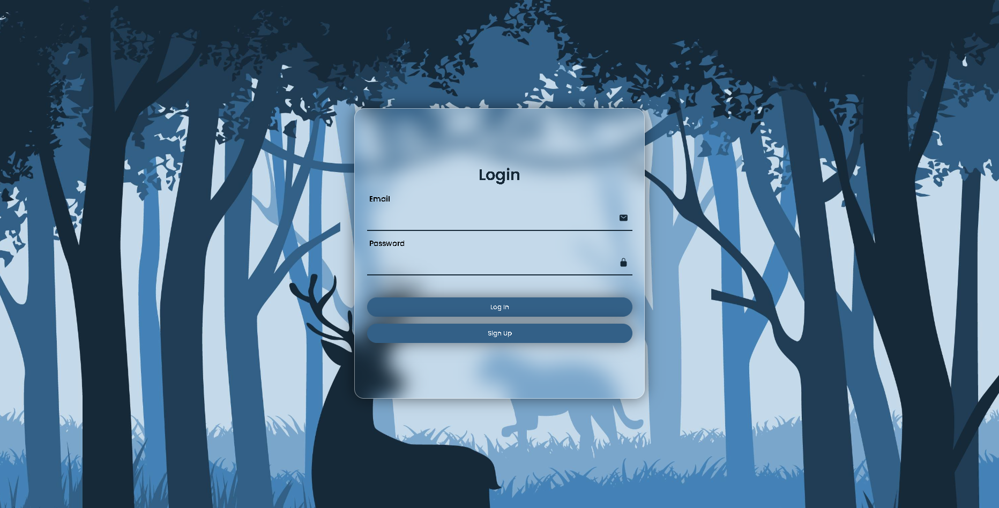

# Проект авторизации с использованием JWT

## Оглавление
- [О проекте](#о-проекте)
- [Требования](#требования)

## О проекте

Проект авторизации с использованием JWT - это полнофункциональная система аутентификации и авторизации, разработанная с использованием React, Express, jsonwebtoken, bcrypt, cookie parser, nodemailer, uuid, mongoose и MongoDB. Этот проект предоставляет безопасный и надежный способ управления аутентификацией пользователей в веб-приложениях.

### Основные особенности

- **JWT-токены**: Проект использует JSON Web Token (JWT) для генерации и проверки аутентификационных токенов. JWT-токены представляют собой безопасный способ передачи информации между клиентом и сервером.
- **Хеширование паролей**: Пароли пользователей хранятся в зашифрованном виде с использованием bcrypt, что обеспечивает высокий уровень безопасности.
- **Cookie-авторизация**: Проект использует cookie-авторизацию для удобного хранения и передачи аутентификационных токенов между клиентом и сервером.
- **Восстановление пароля**: Предоставляется возможность восстановления пароля через отправку электронной почты с уникальной ссылкой для сброса пароля.
- **База данных MongoDB**: Проект использует MongoDB для хранения пользователей, их аутентификационных данных и других связанных с авторизацией данных.

### Как работает проект

Пользователи могут зарегистрироваться в системе, создавая учетные записи с уникальными идентификаторами. После успешной регистрации они могут выполнять вход в систему, предоставляя свои учетные данные. При успешной аутентификации им генерируется JWT-токен, который сохраняется в cookie-файле на клиентской стороне. Затем они могут использовать этот токен для доступа к защищенным ресурсам и функциям веб-приложения.

Проект авторизации с использованием JWT предоставляет надежный и удобный механизм аутентификации, обеспечивая безопасность и защиту персональных данных пользователей.
